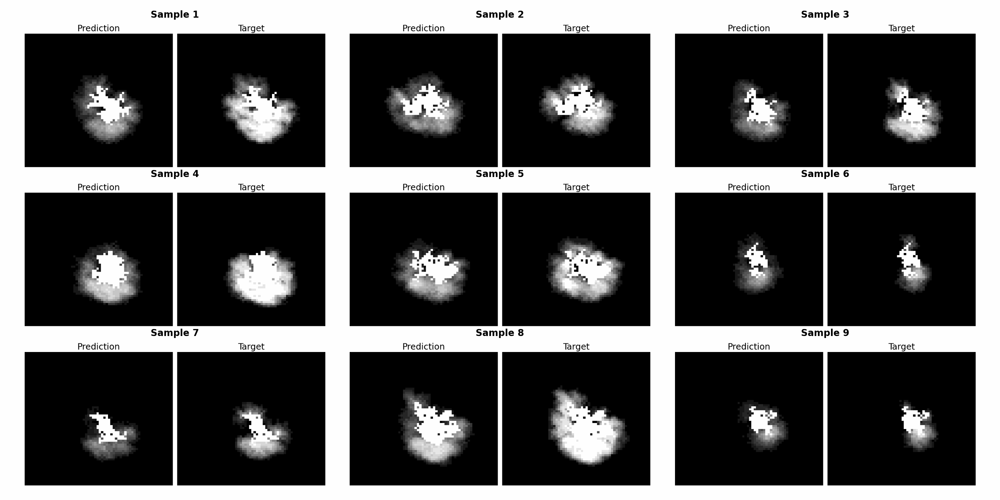

# Wildfire diffusion

## Environment

``` bash
conda env create -f environment.yml
```

## How to use

### Generate dataset

write or load a config file in `./config/data`

```bash
python3 scripts/dataset.py
```

### Train model

write or load a config file in `./config/train`

```
python3 scripts/train_ddim_unet.py
```


<p align="center"></p><p align="center"><b>Figure 1:</b> (a) Ensemble sampling process; (b) generate probabilistic prediction undergoes
multiple diffusion inference processes.</p>


<p align="center"></p><p align="center"><b>Figure 2:</b> Result visualisation.</p>
